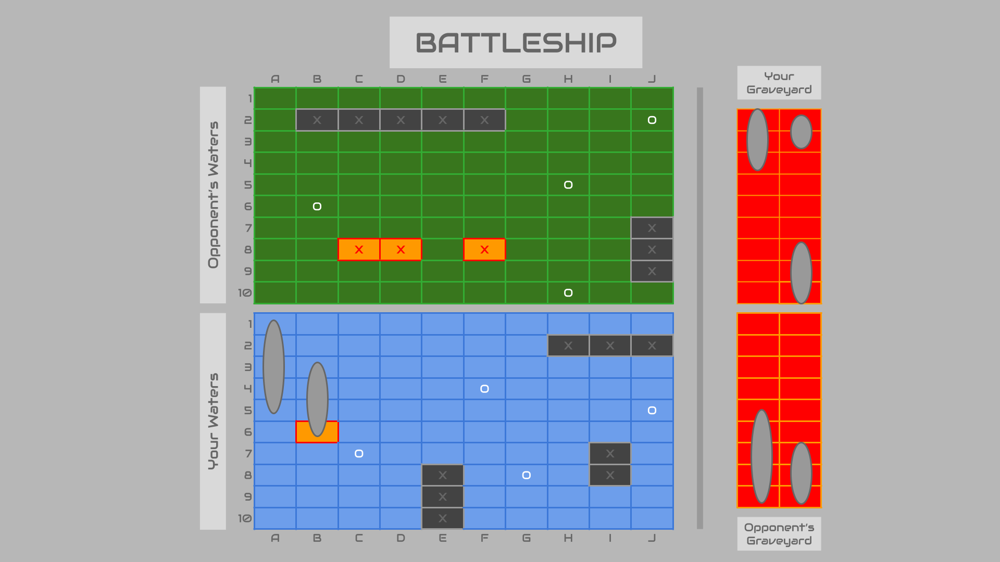

# Battleship - Project 1 Planning
Name: Joe Gilberto (he/him)
## Game Choice - Battleship
## Screenshot for Wireframes

## MVP Pseudocode

### Variables
Sate delcarations: 
- let allyPositions = {}; //an object holding the ally ship positions
- let allyPositions = {}; //an object holding the enemy ship positions
- let badGuess; //a boolean variable marked true if the player guessed a square they had already guessed

Constants:
- timeOut variable set to 3000ms
- Objects holding DOM Element properties

DOM Elements:
- .top-grid > divs
- .bottom-grid > divs
- .ally-grave
- .ally-grave > .ship
- .enemy-grave
- .enemy-grave > .ship

### Init
- Initialize state values
- 

### Event Listners
- addEventListener for .top-grid that runs handleClick()

### Render
- render() //renders all
- renderAllyShips() //renders ally ships starting position on the board
- renderAllyAlreadyGuessed() //renders a red and orange top grid if the user clicks on a square they had already guessed, and then using a setTimeout, after 1000ms, it reverts back to green and sets badGuess false.
- renderAllyHit() //renders when the user hits a ship on the enemy's board
- renderAllyMiss() //renders when the user misses a ship on the enemy's board
- renderEnemyHit() //renders when the computer hits a ship on the enemy's board
- renderEnemyMiss() //renders when the computer misses a ship on the enemy's board
- renderSunkenAllyShips() //renders an ally ship on the graveyard grid when sunken
- renderSunkenEnemyShips() //renders an enemy ship on the graveyard grid when sunken
- renderPlayOrQuit() //renders a popup asking the player if they'd like to play again or quit
- renderResetBoard() //renders a reset board with new ally ship positions and an empty graveyard

### Other Functions
- generateAllyShips() //generates random positions that will be used to render the ally ships and stores them in an object upon initialization
- generateEnemyShips() //generates random positions to stored for the enemy ships upon initialization
- handleClick() //if badGuess is true it runs checkIfOpen() and if that is true it runs checkIfShip, storeAllyHit(), and storeAllyMiss(), and then runs render() no matter what
- checkIfOpen() //checks if a square has already been guessed.  returns true if not, returns false if so and assigns badGuess true.
- checkIfShip() //
- storeAllyHit()
- storAllyMiss()
- enemyThinking()
- enemyGuess()
- storeEnemyHit()
- storEnemyMiss()
- enemyStrategy() //if the computer hits, it will guess around that area
- gameOver()
- determineWinner()
- playOrQuit()
- resetBoard()

### Run the game
- runGame()